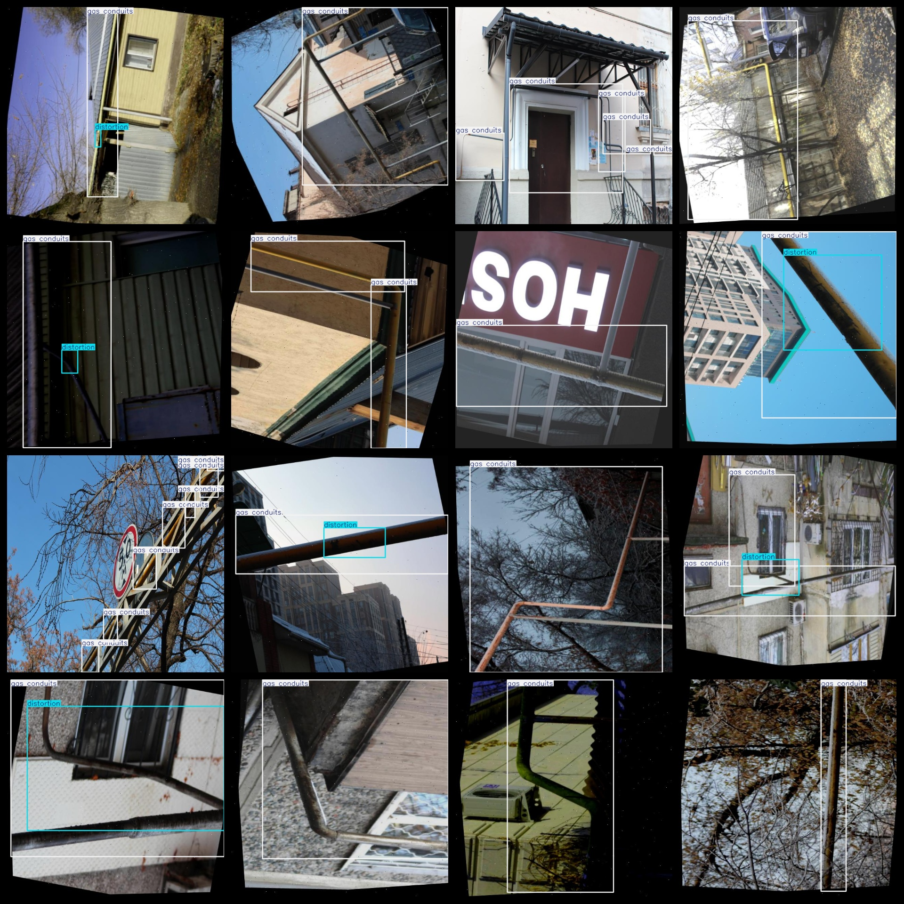
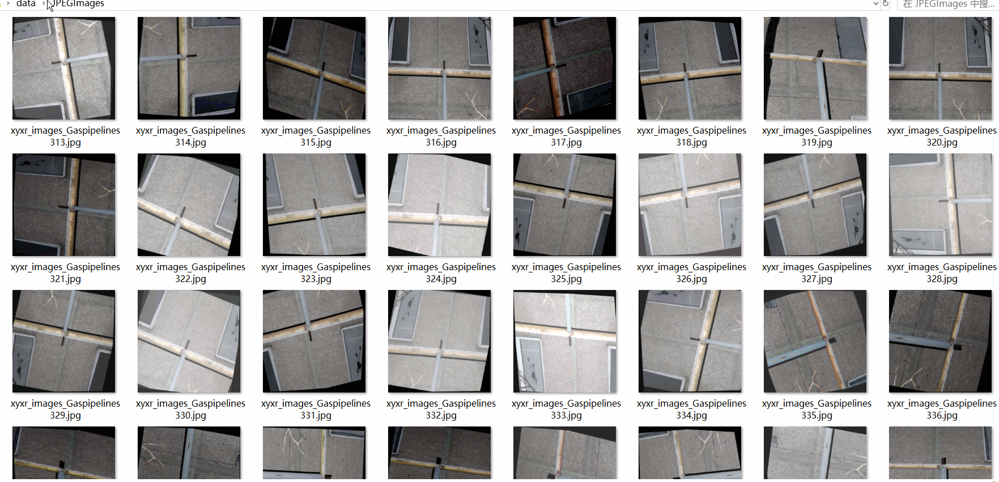

# Methane Pipeline Defect Detection Dataset 14864 imagesVOC+YOLO（(Augmented) ， Mainly for Change Square Detection ）

Gas pipeline defect detection dataset 14864 VOCs + YOLOs (enhanced)

Dataset format: Pascal VOC format + YOLO format (the txt file does not contain the split path, it only contains jpg images and corresponding VOC format xml files and yolo format txt files)

Number of images: 14,864

Number of xml files: 14864

Number of .txt files: 14864

Number of annotated categories: 3

The Github repository is: datasets_sl

["Rust", "distortion", "gas conduits"]

Number of boxes labeled in each category:

Number of Rust frames = 132 (corrosion)

number of distortion boxes = 9221 (distortion)

gas conduits = 23607

Total Frames: 32960

Number of images per category:

Rust has 78 images.

Distortion Ratio = Number of Images Owned / 7894

Gas conduits occupy 14827 pictures.

Image resolution: 640x640

Use the labeling tool: labelImg

Dataset is augmented: Yes (Many augmentations)

Rules for annotation: Draw a rectangle around the category.

Important note: The dataset does not have been divided into training, validation, and testing sets.

Special Disclaimer: This dataset does not guarantee the accuracy of the trained models or weight files.

Annotation and image details are as follows:

## Images

---

Here is a pay link on Stripe (https://buy.stripe.com/3cs8yP7sY87d0vu9AB). Please contact me lonlonago@foxmail.com after funding $89, and I will send you a complete data files, thank you!

